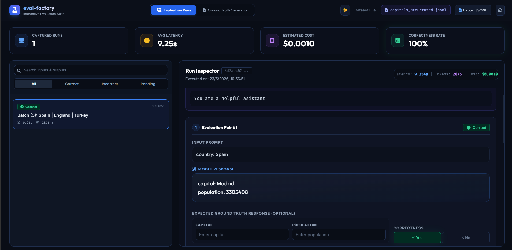
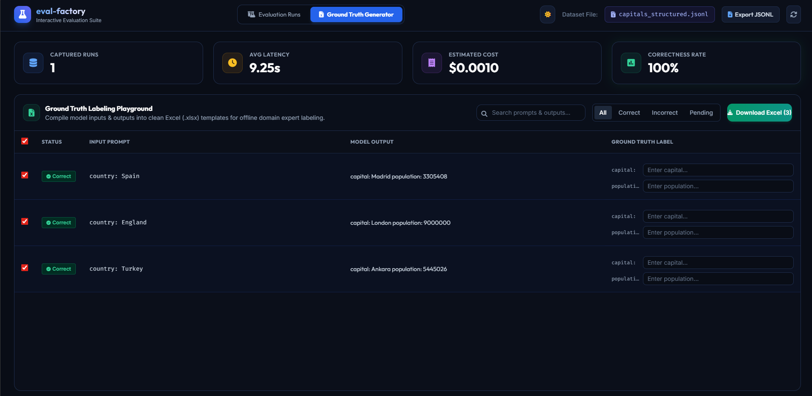

# eval-factory

A lightweight, robust Python package to capture, visualize, and label LLM inputs, outputs, and metadata into local JSONL datasets.

---

## 🚀 Installation

```bash
pip install git+https://github.com/josepmc10/eval-factory.git
```

For local development:
```bash
pip install .
```

---

## ⚡ Quick Start

### 1. Decorate Your LLM Calls
Add `@capture_eval` to your LLM-calling function. It automatically intercepts inputs, outputs, system prompts, and token counts.

```python
from eval_factory import capture_eval
from langchain_openai import ChatOpenAI
from langchain_core.prompts import ChatPromptTemplate

llm = ChatOpenAI(model="gpt-4o", temperature=0)
prompt = ChatPromptTemplate.from_messages([
    ("system", "You are a helpful assistant that replies in French"),
    ("human", "What is the capital of {country}?")
])
chain = prompt | llm

@capture_eval(dataset_name="capitals")
def run_llm_chain(countries):
    # Seamlessly records inputs, batched outputs, costs, and traces!
    return chain.batch([{"country": c} for c in countries])

run_llm_chain(["France", "Germany"])
```

### 2. Launch the Visualizer
Review evaluations, compare system prompts, grade correctness, and type expected ground truths in a gorgeous, zero-dependency local dashboard:

```bash
eval-factory capitals
```

#### 📊 Dashboard Visualizer Overview

| 🧪 Tab 1: Evaluation Runs | 📝 Tab 2: Ground Truth Generator |
| :---: | :---: |
|  |  |

---

## ✨ Features

- **Decorator API**: Simple `@capture_eval(dataset_name="...")` for sync and async Python functions.
- **Fail-Safe Serialization**: Custom encoder prevents crashes with complex Python types, Pydantic models, and LangChain message objects.
- **Auto-Trace Capture**: Crawls execution traces to extract token usage, cost, and system/user prompts automatically.
- **Interactive Local Dashboard**: Visualizes runs, enables human feedback/correctness toggles, and exports datasets directly to clean Excel or `.jsonl` formats.
- **Frictionless Customization**: Supports custom input/output extractor lambdas to handle complex signatures.

---